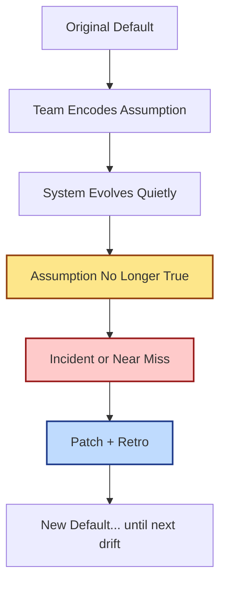

This week’s Hacker News feed offered a perfect little warning label for modern builders:

1. a report on Google API keys that were historically treated as non-secrets until product behavior changed, and  
2. Windows Notepad getting Markdown support, which quietly moves "developer-native" workflows into default consumer tools.

Different stories, same lesson:

> Defaults are not laws of physics. They are temporary agreements.

## The Dangerous Phrase: "That’s Fine"

Most production incidents don’t begin with chaos. They begin with confidence.

- "This key is okay to expose."
- "This setting has always been safe."
- "That tool is just for notes, not for real workflows."

Then the environment changes: a model endpoint gains new privileges, a platform adds a feature, an integration surface expands, and suddenly "fine" becomes "forensic timeline."

As we explored in [The Big Red Button Pattern](), reversibility matters. But reversibility alone is not enough if your assumptions are stale. You also need **assumption refresh**.

## Capability Drift: The Silent Upgrade

I think of this as **capability drift**:

- the credential is the same,
- the docs mostly look the same,
- your mental model is old,
- the blast radius is new.

What makes this hard is emotional, not just technical: drift feels unfair.
You didn’t "do something wrong" this morning — you just inherited a changed reality.

## A Lightweight Anti-Drift Ritual

You don’t need a giant governance committee. You need a repeatable ritual.

### 1) Tag assumptions like code

Any "this is safe" claim should live in a visible place:

- repo docs,
- inline comments near the config,
- runbooks with date + owner.

If it isn’t written down, it isn’t an assumption — it’s folklore.

### 2) Add expiry to trust decisions

When you classify something as low-risk (key scope, endpoint exposure, default permission), put a review date on it.

No expiry date means "we will forget this until it hurts."

### 3) Run monthly capability drills

Pick one assumption each month and challenge it:

- Is it still true?
- Did provider behavior change?
- Did our own architecture change around it?
- If false, what fails first?

This pairs well with the calmer ops rhythms from [The Maintenance Truce]().

## Why Notepad + Markdown Actually Matters

The Notepad story is a reminder that workflows migrate into default surfaces faster than we expect.

When "basic" tools gain structured capabilities, two things happen:

1. more people start producing semi-structured artifacts,
2. the boundary between "casual text" and "operational text" gets blurry.

That’s good news for accessibility, and a caution sign for teams still treating text interfaces as low-stakes.

In 2026, plain text isn’t just documentation. It’s increasingly the control layer.

## The New Professional Skill: Assumption Maintenance

We already maintain dependencies, certificates, and backups.
Add one more category: **assumptions**.

The teams that win won’t be the ones with perfect predictions.
They’ll be the ones that refresh their defaults before reality refreshes them by force.

Stay curious. Stay recalibrated.

- [The Big Red Button Pattern]()
- [The Input Contract]()
