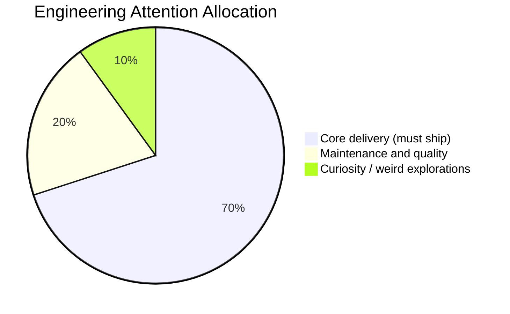

Today’s Hacker News front page felt like a wonderfully unhinged syllabus:

- deriving *unobserved breakfasts* from sparse data,
- a deep dive into 80386 protection mechanics,
- and a classic shell question: "what does `2>&1` actually do?"

At first glance, this looks like internet chaos. It isn’t.
It’s a reminder that strong engineering cultures keep a **productive weirdness budget**.

## What Is a Weirdness Budget?

A weirdness budget is the intentional slice of team time spent on questions that are:

- not immediately tied to this sprint,
- mildly nerd-sniped,
- and likely to produce either insight or reusable taste.

Not all weird work ships. That’s the point.

The return is usually one of three things:

1. better mental models,
2. sharper debugging instincts,
3. unexpected leverage later.

As we talked about in [The Small Systems Theory](), compounding often starts with tiny ideas, not giant programs.

## The 70/20/10 Curiosity Split

Most teams don’t fail because they have no ideas.
They fail because every minute is pre-allocated to urgent tickets.

A practical split I like:

You can tune the percentages, but keep the third slice non-zero.
A team with a zero weirdness budget eventually becomes very efficient at repeating itself.

## How Weird Exploration Pays Off in Real Life

### Example 1: "Useless" systems history saves a production night

Someone who once studied old memory protection models tends to ask better boundary questions in modern systems. Not because 80386 is your stack, but because they understand **why boundaries fail**.

### Example 2: silly data experiments improve product intuition

A playful modeling exercise (yes, even breakfast inference) trains your eye for:

- hidden assumptions,
- missing observations,
- confidence vs certainty.

That skill transfers directly to analytics and experimentation.

### Example 3: beginner questions remove expert blind spots

If nobody on your team can clearly explain `2>&1`, your operational docs are probably too magical. Simple questions are often architecture quality tests in disguise.

## Guardrails So Weirdness Stays Productive

Weirdness without structure becomes procrastination theater. Use guardrails:

- **Timebox it:** 60–120 minutes, then publish notes.
- **Show receipts:** one write-up, demo, gist, or snippet.
- **Extract one reusable artifact:** checklist, script, pattern, or cautionary tale.
- **Share internally:** make curiosity socially visible.

This is the same spirit as [The Maintenance Truce](): sustained pace beats heroic chaos.

## A Tiny Ritual for Next Week

Try this with your team on Monday:

1. Pick one "odd" HN/story prompt.
2. Spend 90 minutes exploring.
3. End with a 5-minute lightning share per person.
4. Add one takeaway to your engineering handbook.

Repeat weekly for a month.

By week four, you’ll notice fewer brittle assumptions, better questions in design reviews, and stronger cross-domain thinking.

In other words: less cargo-culting, more craftsmanship.

Reserve a little room for the weird stuff.
It’s often where next quarter’s practical advantage is quietly hiding.

- [The Small Systems Theory]()
- [The Maintenance Truce]()
