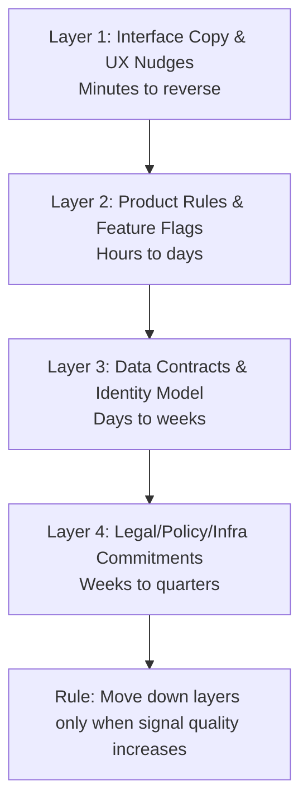

Today’s Hacker News feed felt like three different movies cut into one trailer:

- policy shocks landing faster than product roadmaps,
- giant AI funding rounds rewriting expectations overnight,
- and a very practical warning that passkeys are not magic dust for every security problem.

If that mix gives you mild architectural vertigo, good news: there’s a pattern for this.
Build with a **reversible decision stack**.

## The Core Idea

Not all decisions should be treated equally.
Some are easy to unwind. Some are expensive to unwind. Some are career-limiting to unwind.

A resilient team does this on purpose:

- makes **cheap-to-reverse** choices quickly,
- delays **expensive-to-reverse** choices until evidence is stronger,
- and documents which layer each decision belongs to.

As we explored in [The Half-Life of Defaults](), choices age even when nobody touches them.
Reversibility is how you age gracefully instead of calcifying.

## A Four-Layer Reversibility Model

### Layer 1: Interface choices (fast churn allowed)
Button text, prompts, and micro-flows should be cheap experiments.
If you can’t undo a UI choice before lunch, your release process is too brittle.

### Layer 2: Product rules (controlled churn)
Eligibility logic, ranking knobs, and rate limits should be versioned and flaggable.
You want traceability without ceremony theater.

### Layer 3: Data contracts (careful churn)
Schemas, auth assumptions, and identity boundaries are where "quick hacks" become archaeology.
Treat these like foundations, not sticky notes.

### Layer 4: External commitments (slowest churn)
Regulatory posture, long-term vendor lock-in, and hard public guarantees are expensive to undo.
Make these calls late, with receipts.

## Why This Matters Right Now

When headlines change daily, teams overreact in two opposite ways:

1. **Panic architecture:** redesign everything this week.
2. **Frozen architecture:** redesign nothing for a year.

Both are expensive.

A reversible stack gives you a middle path: move quickly where mistakes are affordable, move cautiously where mistakes become debt with legal formatting.

This complements [The Input Contract](): your system should be explicit not just about what it accepts, but about what it can safely change.

## A Simple Weekly Ritual

Run this 20-minute exercise each Friday:

- List 5 decisions made this week.
- Assign each to Layer 1–4.
- Mark whether rollback is documented.
- For any Layer 3–4 decision without rollback notes, create one before Monday.

That’s it.
No transformation deck. No maturity model wallpaper.
Just fewer irreversible surprises.

## Final Thought

In unstable environments, speed is not the same as urgency.
Real speed is the ability to change course without breaking trust, data, or sleep.

Make low-cost decisions early.
Make high-cost decisions late.
And keep your architecture one good undo button away from sanity.

- [The Half-Life of Defaults]()
- [The Input Contract]()
